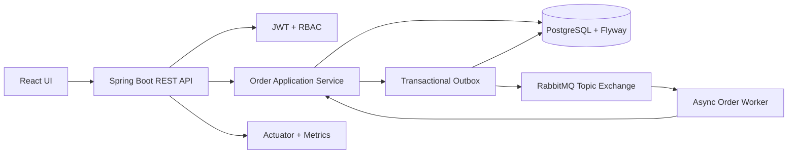
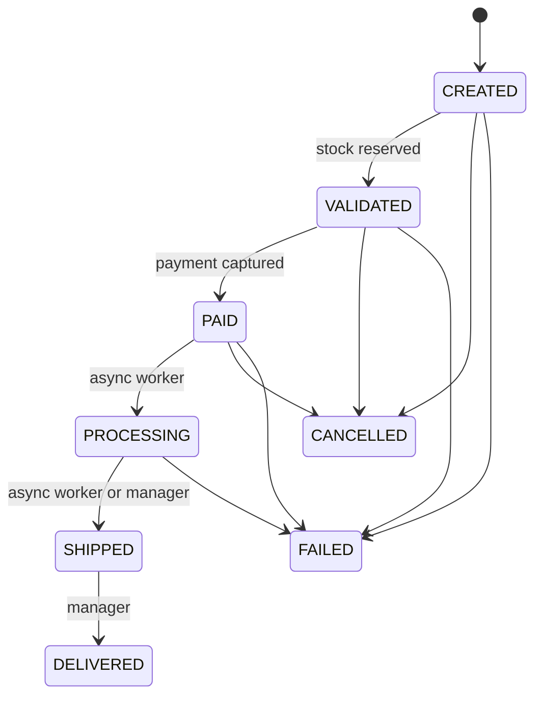

# NexusFlow Enterprise Order Processor

NexusFlow is a Spring Boot + React order-processing system that demonstrates enterprise backend design, secure role-based workflows, PostgreSQL persistence, and RabbitMQ-driven async order handling.

## Problem It Solves

Enterprise order systems need to validate inventory, reserve stock, process payments, expose operational order workflows, and keep an audit trail without letting controllers become business-logic dumping grounds. NexusFlow models that flow in a compact portfolio project that is realistic enough for senior Java/Spring interviews without pretending to be a full ERP.

## Tech Stack

- Backend: Java 17, Spring Boot 3.2, Spring Web, Spring Data JPA, Spring Security, JWT, Spring AMQP, Actuator, OpenAPI
- Frontend: React 19, TypeScript, Vite, React Router, Axios, vanilla CSS
- Data and infrastructure: PostgreSQL 15, Flyway, RabbitMQ Management, Docker Compose
- Testing: JUnit 5, Mockito, Spring MVC tests, Spring Data JPA tests, Testcontainers for PostgreSQL when Docker is available
- CI: GitHub Actions for backend verification, frontend build, and frontend lint

## Architecture

The backend uses a pragmatic package structure:

- `domain/model`: JPA entities and enums
- `application/service`: business rules, state machine, metrics
- `infrastructure/persistence`: Spring Data repositories
- `infrastructure/messaging`: transactional outbox, RabbitMQ configuration, message DTOs, publisher, consumer
- `web/controller` and `web/dto`: REST API and DTO boundaries
- `security`, `config`, `exception`: JWT/RBAC, CORS, request correlation, health, structured errors



## Order Lifecycle



## Key Features

- Validated order creation with stock reservation and idempotency key support
- Payment simulation that commits or releases reserved inventory
- Enforced order status transitions with clear `409 Conflict` responses
- Order audit history for lifecycle changes with actor and correlation ID
- Paged, filterable, sortable order listing
- Flyway-managed database schema
- Transactional outbox for RabbitMQ status-change events
- RabbitMQ durable queue and dead-letter queue
- Async worker that advances paid orders into processing and shipped states
- JWT authentication with `USER`, `MANAGER`, and `ADMIN` roles
- BCrypt password hashing and seeded demo users
- DTO-based REST API responses instead of leaking JPA entity graphs
- Structured error responses with validation details and correlation IDs
- Actuator health and order-processing health indicator
- React dashboard for order creation, payment, cancellation, and history
- Operations UI for inventory visibility and staff order transitions

## Security

- Public endpoints: `/api/auth/register`, `/api/auth/login`, Swagger, API docs, health
- Authenticated endpoints: product list, order creation/list/detail/payment/status
- Staff endpoints: inventory and operational order actions
- Admin-only endpoints: create/update/delete products
- Sensitive values are read from environment variables; see `.env.example`
- Public registration creates `ROLE_USER` only; staff users are seeded for local demo

## Async Processing

When an order reaches `PAID`, the order transaction stores an `ORDER_STATUS_CHANGED` message in `outbox_events` with a correlation ID. A scheduled relay publishes pending outbox rows to the `nexusflow.orders` topic exchange and marks them `PUBLISHED`, `FAILED`, or `DEAD` based on retry outcome. The RabbitMQ consumer listens on `nexusflow.order-events` and advances paid orders to `PROCESSING` and then `SHIPPED`. Failed RabbitMQ deliveries route to `nexusflow.order-events.dlq`.

## Run Locally

Prerequisites: Docker Desktop.

```bash
docker compose --env-file .env.example up --build
```

Access points:

- Frontend: http://localhost:5173
- Backend API: http://localhost:8080
- Swagger UI: http://localhost:8080/swagger-ui.html
- API docs: http://localhost:8080/api-docs
- Health: http://localhost:8080/actuator/health
- RabbitMQ dashboard: http://localhost:15672

Demo credentials from seed data:

- User: `user` / `user12345`
- Manager: `manager` / `manager123`
- Admin: `admin` / `admin123`
- RabbitMQ UI: values from `.env.example` (`nexus` / `nexus_dev_password`)

For local non-Docker backend work, set `JWT_SECRET`, `SPRING_DATASOURCE_PASSWORD`, and `SPRING_RABBITMQ_PASSWORD` before running `mvn spring-boot:run`.

## API Highlights

- `POST /api/orders` with `Idempotency-Key`
- `GET /api/orders?status=VALIDATED&size=10&sort=createdAt,desc`
- `GET /api/orders/{id}`
- `POST /api/orders/{id}/payments`
- `PATCH /api/orders/{id}/status`
- `GET /api/products`
- `GET /api/admin/inventory`
- `POST /api/admin/products`

## Testing

```bash
cd server
mvn test

cd ../client
npm ci
npm run lint
npm run build
```

Current automated coverage includes:

- Order state transitions, idempotency, stock reservation, payment commit/release
- Transactional outbox enqueueing and relay publish/retry behavior
- Product service validation paths
- Controller validation, authentication requirement, payment/status endpoints
- JPA optimistic locking
- PostgreSQL Testcontainers persistence check when Docker is available

On the current machine, the Testcontainers test skipped because Docker Desktop was not exposing a usable Docker engine. The rest of the backend suite passed.

## CI/CD

`.github/workflows/ci.yml` runs:

- Backend: `mvn -B verify`
- Frontend: `npm ci`, `npm run build`, `npm run lint`

No README badges are included because badges should only be added after the workflow runs successfully on the repository remote.

## Screenshots

Screenshots are not committed yet. Recommended captures after starting Docker Compose:

- Login page with demo credential note
- User dashboard showing product availability and order history
- Operations page showing inventory reservations and order transitions
- Swagger UI with authorized JWT
- RabbitMQ queue view for `nexusflow.order-events`

## Interview Talking Points

- Why order transitions belong in an application service/state machine instead of controllers
- How optimistic locking protects stock updates under concurrent orders
- Why stock is reserved at validation and committed at payment capture
- How idempotency protects retries from duplicate order creation
- How the transactional outbox prevents order commits from depending on RabbitMQ availability
- How RBAC is split between endpoint security and business rules
- How structured errors and correlation IDs improve debugging

## What I Would Improve Next

- Add RabbitMQ Testcontainers coverage
- Add a replay/admin endpoint for dead outbox events
- Add refresh tokens and token revocation for a production auth model
- Add Playwright UI tests and committed screenshots
- Add Prometheus/Grafana dashboards for the custom order metrics
